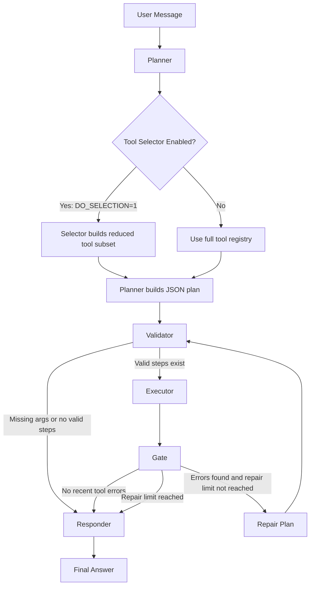

# Donor Agent Technical Documentation

Approaches Implemented & System Architecture

Version 2.0 | March 2026

# 1. Overview

> *This agent reads a donor’s request, chooses the right tools (that interacts with backend server), runs them, repairs some failures automatically, and then answers using real system data rather than guessing.*

The Donor Agent is a unified conversational AI system that brings together charity discovery, donor transactions, and auction workflows inside one shared LangGraph pipeline.

<html><body><table><tr><td>Domain</td><td>Primary Responsibility</td><td>Current Backend</td></tr><tr><td>Charity Layer</td><td>Discover charities, fetch charity details, inspect website content, support charity comparisons</td><td>Giverr production API + MCP fetch tool</td></tr><tr><td>Transaction Layer</td><td>Wallet, payment methods, campaigns, grants, product donations, transaction history</td><td>Giverr production API</td></tr><tr><td>Auction Layer</td><td>Browse auctions, inspect auction detail, review bid history, place bids</td><td>Giverr production API</td></tr></table></body></html>

All three domains share the same execution model:

- one graph
- one planner
- one validator
- one executor
- one repair gate
- one responder
- one message history system

This means the assistant behaves as one coordinated worker rather than three separate chatbots.

 

 

# 2. System Architecture

# 2.1 LangGraph Pipeline

Every user request moves through a directed graph defined in `main_agent.py` and `nodes.py`.

The graph contains five active nodes:

1. Planner
2. Validator
3. Executor
4. Gate
5. Responder

The graph starts at `planner` and ends at `responder`.

          

 

   

 

 

 

 

# 2.2 Node Responsibilities

# Planner

The planner receives:

- the latest user message
- a formatted view of previous conversation history
- a dynamically rendered catalog of the currently registered tools

It then uses the LLM to produce strict JSON with two keys:

<html><body><table><tr><td>Field</td><td>Meaning</td></tr><tr><td>steps</td><td>Ordered list of tool calls to execute</td></tr><tr><td>missing_args</td><td>Inputs that must be collected from the user before execution can continue</td></tr></table></body></html>

The planner is intentionally biased toward full coverage. If the required information is not already present in successful prior tool outputs, it is instructed to schedule the maximum relevant tool plan rather than under-plan.

# Planner Selector Function

The planner has an optional selector stage controlled by the `DO_SELECTION` environment flag.

When enabled, `build_tool_context()` first asks the LLM to choose a maximal plausible subset of tools before the actual planning prompt is built.

<html><body><table><tr><td>Mode</td><td>Behavior</td></tr><tr><td>`DO_SELECTION = false`</td><td>The planner sees the full registered tool catalog</td></tr><tr><td>`DO_SELECTION = true`</td><td>A selector prompt first reduces the tool list to a plausible subset, and the planner then plans only within that reduced catalog</td></tr></table></body></html>

Why this exists:

- it can reduce prompt size
- it can reduce planner confusion when many tools exist
- it is designed to remove only clearly implausible tools, not aggressively narrow the search space

# Validator

The validator checks the plan before any tool is executed.

It performs three core duties:

<html><body><table><tr><td>Check</td><td>Behavior</td></tr><tr><td>Tool existence</td><td>Removes plan steps whose tool names are not present in the live tool registry</td></tr><tr><td>Missing inputs</td><td>Stops execution and tells the responder to ask the user for the missing values</td></tr><tr><td>No-tool case</td><td>Routes directly to final response when the request can be answered from existing history</td></tr></table></body></html>

# Executor

The executor is a tool runner, not a reasoning agent.

It:

- executes the validated tools one by one
- supports async invocation when available
- records every call as an `AIMessage` with a generated tool call ID
- stores every result as a `ToolMessage`

Each result is normalized into a predictable envelope:

Success:

`{"ok": true, "result": {...}}`

Failure:

`{"ok": false, "error": "reason"}`

This makes downstream processing tool-agnostic.

# Gate (Repair / Replanner Node)

The gate runs after the executor.

Its purpose is to detect tool failures and attempt automatic repair cycles. It looks only at the current round of tool outputs and checks for:

- explicit `ok: false` failures
- traceback-like strings
- common error markers such as `SyntaxError`, `TypeError`, `Invalid`, or `missing`

If an error is found and the repair limit has not been reached, the gate asks the LLM to create a corrected plan and routes the flow back to the validator.

This is especially useful when a multi-step request depends on one tool’s output being transformed by another tool, such as Python-based numeric analysis.

# Multi-Gate Repair Attempts

The gate supports more than one repair attempt, even though the default limit is usually `1`.

The current implementation tracks `repair_attempts` in graph state and compares it with `max_repairs`, which is loaded from `GATE_REPAIR_LIMIT`.

<html><body><table><tr><td>Behavior</td><td>Implementation Detail</td></tr><tr><td>First failure pass</td><td>The gate inspects recent tool outputs and builds a repair prompt</td></tr><tr><td>Multiple detected failures</td><td>The repair prompt explicitly requires at least one repair step per detected error, in the same order</td></tr><tr><td>Repeated repair loops</td><td>The graph can cycle Gate → Validator → Executor → Gate until `repair_attempts` reaches `max_repairs`</td></tr><tr><td>Limit reached</td><td>The gate stops retrying and routes to the responder with a system note</td></tr></table></body></html>

This means the gate has two separate “multi” behaviors:

- it can repair multiple tool failures inside one gate pass
- it can perform multiple gate passes across the same user turn when the configured repair limit is greater than 1

# Responder

The responder produces the final user-facing answer.

It receives a cleaned version of the conversation history and is instructed to:

- use only information explicitly present in tool outputs
- avoid inventing facts
- keep the answer donor-friendly
- ask for the minimum missing input when required

The responder also has special behavior for password failures and reuses prior successful tool outputs from conversation history where appropriate.

# 2.3 Routing Logic

Two routing functions in `routing.py` control the graph transitions after validation and repair.

<html><body><table><tr><td>Decision Point</td><td>Condition</td><td>Route</td></tr><tr><td>After Validator</td><td>At least one valid tool step exists</td><td>Executor</td></tr><tr><td>After Validator</td><td>No valid steps remain, either because tools are unnecessary or because user input is missing</td><td>Responder</td></tr><tr><td>After Gate</td><td>Repair plan contains steps and repair limit is not reached</td><td>Validator</td></tr><tr><td>After Gate</td><td>No repair needed, no repair steps produced, or repair limit reached</td><td>Responder</td></tr></table></body></html>

# 2.4 State Schema

The graph carries a shared `AgentState` object.

<html><body><table><tr><td>Field</td><td>Type</td><td>Purpose</td></tr><tr><td>messages</td><td>Sequence of LangChain messages</td><td>Complete interaction history including user input, tool calls, tool outputs, and AI responses</td></tr><tr><td>plan</td><td>Dictionary</td><td>Current execution plan from planner or gate</td></tr><tr><td>repair_attempts</td><td>Integer</td><td>Prevents infinite repair loops</td></tr><tr><td>last_tool_error</td><td>Dictionary</td><td>Stores the latest detected tool failure for debugging and control flow</td></tr></table></body></html>

# 3. Tool Registry

# 3.1 Tool Loading Strategy

All tools are assembled in `tools/tool_setup.py`.

The registry combines four sources:

<html><body><table><tr><td>Source</td><td>What It Adds</td></tr><tr><td>`tools/analytics.py`</td><td>Charity discovery and charity detail tools</td></tr><tr><td>`tools/transactions.py`</td><td>Wallet, payment, campaign, grant, donation, and history tools</td></tr><tr><td>`tools/auctions.py`</td><td>Auction browsing, bid history, bidding, and category-based charity tools</td></tr><tr><td>MCP + Local Utility Tools</td><td>`fetch_url` from MCP and `PythonREPLTool` for calculations</td></tr></table></body></html>

At runtime the tool registry is dynamic, meaning the planner sees the tools that are actually loaded, not a fixed list hardcoded in the prompt.

The registry is also the input to the optional selector function. When selector mode is enabled, the system first asks the LLM which tools are plausibly relevant, then passes only that reduced set into the main planner prompt.

# 3.2 Charity Tools

The current charity layer differs from the older `Agent.md` file. The live code exposes these charity tools:

<html><body><table><tr><td>Tool</td><td>Type</td><td>Current Purpose</td></tr><tr><td>discover_charities</td><td>StructuredTool</td><td>Fetch a broad charity list for discovery, ranking, and obtaining charity IDs</td></tr><tr><td>charity_details</td><td>StructuredTool</td><td>Fetch detail for one charity, including donation metrics, products, blogs, address, and contact data</td></tr><tr><td>fetch_url</td><td>MCP Tool</td><td>Fetch website content from the charity website URL for richer answering</td></tr><tr><td>Python_REPL</td><td>Local Tool</td><td>Run Python code for calculations and transformations</td></tr></table></body></html>

Charity endpoints currently used:

<html><body><table><tr><td>Tool</td><td>Method</td><td>Endpoint / Mechanism</td></tr><tr><td>discover_charities</td><td>GET</td><td>/api/v3/agent/charities/discovery</td></tr><tr><td>charity_details</td><td>GET</td><td>/api/v3/agent/charities/{charityId}/detail</td></tr><tr><td>fetch_url</td><td>MCP</td><td>External fetcher process via `npx -y fetcher-mcp`</td></tr><tr><td>Python_REPL</td><td>Local</td><td>In-process Python execution</td></tr></table></body></html>

# 3.3 Transaction Tools

The transaction layer currently exposes these tools:

<html><body><table><tr><td>Tool</td><td>Type</td><td>Description</td></tr><tr><td>check_wallet_balance</td><td>GET</td><td>Fetch wallet details for the authenticated donor</td></tr><tr><td>get_payment_methods</td><td>GET</td><td>List saved payment methods</td></tr><tr><td>add_payment_method</td><td>GET</td><td>Return a hosted URL for adding a payment method</td></tr><tr><td>list_charities_by_country</td><td>GET</td><td>List charities available for a specified country code</td></tr><tr><td>get_charity_donation_products</td><td>GET</td><td>List donation products for a charity</td></tr><tr><td>get_all_charities_with_grants</td><td>GET</td><td>List charities and their grants</td></tr><tr><td>get_all_active_campaigns</td><td>GET</td><td>List active campaigns</td></tr><tr><td>get_donation_types_campaign</td><td>GET</td><td>List donation type categories used by campaigns</td></tr><tr><td>get_transaction_history</td><td>GET</td><td>Fetch wallet transaction history</td></tr><tr><td>fund_wallet</td><td>POST</td><td>Add funds to the donor wallet</td></tr><tr><td>product_donation</td><td>POST</td><td>Create a product donation</td></tr><tr><td>campaign_donation</td><td>POST</td><td>Create a campaign donation</td></tr><tr><td>grant_donation</td><td>POST</td><td>Create a grant donation</td></tr></table></body></html>

# 3.4 Auction Tools

The current auction layer exposes these tools:

<html><body><table><tr><td>Tool</td><td>Type</td><td>Description</td></tr><tr><td>get_active_auctions</td><td>GET</td><td>Fetch active auction records</td></tr><tr><td>get_auction_details</td><td>GET</td><td>Fetch one auction by exact `_id`</td></tr><tr><td>get_my_bid_history</td><td>GET</td><td>Fetch the donor’s bid history</td></tr><tr><td>place_bid</td><td>POST</td><td>Place a bid using auction ID, amount, and password</td></tr><tr><td>get_donation_categories</td><td>GET</td><td>List donation categories</td></tr><tr><td>get_charities_by_donation_type</td><td>GET</td><td>List charities for a selected donation type and country</td></tr></table></body></html>

Auction endpoints currently used:

<html><body><table><tr><td>Tool</td><td>Method</td><td>Endpoint</td></tr><tr><td>get_active_auctions</td><td>GET</td><td>/api/v3/agent/auctions/list</td></tr><tr><td>get_auction_details</td><td>GET</td><td>/api/v3/agent/auctions/{auction_id}</td></tr><tr><td>get_my_bid_history</td><td>GET</td><td>/api/v3/agent/user/{DONOR_PROFILE_ID}/bids</td></tr><tr><td>place_bid</td><td>POST</td><td>/api/v3/agent/auctions/{auction_id}/bid</td></tr><tr><td>get_donation_categories</td><td>GET</td><td>/api/v3/agent/donation-categories</td></tr><tr><td>get_charities_by_donation_type</td><td>GET</td><td>/api/v3/agent/charities/by-donation-type</td></tr></table></body></html>

# 3.5 Tool Guidance Embedded in Code

The tool descriptions are not just labels. They also contain operational instructions for the planner.

Examples of encoded tool guidance:

<html><body><table><tr><td>Guidance Pattern</td><td>Why It Matters</td></tr><tr><td>“Use exact `_id` only”</td><td>Prevents the planner from sending human display numbers like 1 or 2 to backend endpoints</td></tr><tr><td>“Call this first”</td><td>Enforces multi-step flows such as category lookup before charity-by-category lookup</td></tr><tr><td>Password required</td><td>Prevents sensitive actions such as `place_bid` from being executed without explicit user authorization input</td></tr><tr><td>Website fetch hints</td><td>Encourages the planner to pair charity detail retrieval with website content retrieval when needed</td></tr></table></body></html>

# 4. Charity Flow

# 4.1 Purpose

The charity flow helps the user:

- discover charities
- inspect one charity in depth
- compare charities using list data
- inspect a charity website when needed
- compute statistics using Python when a numeric transformation is required

# 4.2 Actual Current Flow

The current implementation is different from the old “single `get_charity_stats` tool” design.

The real code uses a two-level approach:

<html><body><table><tr><td>Step</td><td>Action</td></tr><tr><td>1</td><td>Use `discover_charities` to gather broad charity records and IDs</td></tr><tr><td>2</td><td>Use `charity_details` for one selected charity when deeper fields are needed</td></tr><tr><td>3</td><td>Use `fetch_url` to retrieve the charity website content when external context is useful</td></tr><tr><td>4</td><td>Use `Python_REPL` if the user asks for a calculation based on tool output</td></tr></table></body></html>

# 4.3 Example Charity Questions the System Can Handle

<html><body><table><tr><td>User Need</td><td>Likely Tool Pattern</td></tr><tr><td>“Show me charities”</td><td>`discover_charities`</td></tr><tr><td>“Tell me about this charity”</td><td>`charity_details`</td></tr><tr><td>“What does their website say?”</td><td>`charity_details` + `fetch_url`</td></tr><tr><td>“Which charity has the highest donor count?”</td><td>`discover_charities` and optional `Python_REPL` for sorting or aggregation</td></tr></table></body></html>

# 5. Transaction Flow

# 5.1 Purpose

The transaction flow supports donor financial actions and account visibility.

It can help the user:

- check wallet status
- review payment methods
- fund the wallet
- browse campaigns and grants
- donate to campaigns, grants, or products
- inspect transaction history

# 5.2 Authentication Model

Transaction tools currently use a hardcoded bearer token in `tools/transactions.py`.

This means:

- the assistant is currently tied to a demo donor context
- it is not yet using a real logged-in session
- the behavior is suitable for controlled testing, not production-grade identity isolation

# 5.3 Password Verification

Sensitive actions in the current implementation can require password verification.

For example, `place_bid` in the auction layer imports `verify_user_password` from the transaction layer before submitting the actual API call.

The current password flow is local and demo-oriented:

<html><body><table><tr><td>Current Behavior</td><td>Meaning</td></tr><tr><td>Bcrypt hash stored in code</td><td>Password verification is mocked locally instead of delegated to a production identity system</td></tr><tr><td>Responder special-case</td><td>If password validation fails, the conversation can prompt the user to enter the password again</td></tr></table></body></html>

# 6. Auction Flow

# 6.1 Purpose

The auction flow lets the user:

- browse available auctions
- inspect a specific auction
- review personal bid history
- place bids with password confirmation

# 6.2 Bid Execution Rules in Current Code

The current code enforces several important rules before placing a bid:

<html><body><table><tr><td>Rule</td><td>Implementation Intent</td></tr><tr><td>Exact auction ID required</td><td>`place_bid` expects the real backend `_id`, not a display number</td></tr><tr><td>Positive amount required</td><td>The tool rejects zero or negative bids</td></tr><tr><td>Password required</td><td>The tool fails fast if password is missing</td></tr><tr><td>Password verified before request</td><td>The tool checks the password locally before sending the API bid request</td></tr></table></body></html>

# 6.3 Auction Identity Headers

Auction tools currently use:

- `X-API-KEY`
- encrypted `X-USER-ID` for user-scoped actions

The user ID is encrypted with AES-256-CBC inside `tools/auctions.py` before being sent in headers.

This is an implementation detail intended to match the expected backend contract.

# 6.4 Current Auction Limitation

`get_my_bid_history` uses a placeholder value:

`DONOR_PROFILE_ID = "PENDING"`

This means that bid-history behavior is not yet fully production-ready unless that value is replaced with the correct donor profile ID at runtime.

# 7. Shared Infrastructure

# 7.1 LLM Configuration

The planner, gate, and responder all call `make_model()` from `llm.py`.

<html><body><table><tr><td>Setting</td><td>Current Behavior</td></tr><tr><td>Client Library</td><td>`langchain_openai.ChatOpenAI`</td></tr><tr><td>Serving Pattern</td><td>OpenAI-compatible API usage, which can target NVIDIA NIM model endpoints</td></tr><tr><td>Authentication</td><td>API key is passed through the OpenAI-compatible client configuration</td></tr><tr><td>Model</td><td>The model name is configured in `llm.py` and can represent an NVIDIA NIM-served model when the client is pointed to that endpoint</td></tr><tr><td>Temperature</td><td>0.0 for deterministic responses</td></tr></table></body></html>

The selector function, when enabled, uses the same model instance pattern as the planner.

# 7.2 History Formatting

History formatting is one of the core engineering choices in this project.

Different nodes receive different views of the same conversation:

<html><body><table><tr><td>Formatter</td><td>Used By</td><td>Purpose</td></tr><tr><td>`format_history_for_planner`</td><td>Planner</td><td>Shows reusable successful past outputs without clutter from the current user turn</td></tr><tr><td>`format_history_for_gate`</td><td>Gate</td><td>Shows only the current round so repair logic can focus on recent failures</td></tr><tr><td>`format_history_for_responder`</td><td>Responder</td><td>Builds a clean transcript for final answer generation</td></tr><tr><td>`build_cached_tool_outputs`</td><td>Gate</td><td>Provides latest tool outputs to help the repair prompt build corrected tool steps</td></tr></table></body></html>

# 7.3 Sensitive Data Handling

Sensitive values are sanitized before they are placed back into LLM-visible history.

The current sanitization logic removes fields such as:

- authorization
- token
- api_key
- password
- secret
- private_key

This behavior is implemented in `tools/json_utils.py` and `history_formatters.py`.

# 7.4 JSON Utilities

The project uses defensive JSON helpers so malformed LLM output does not crash the pipeline.

<html><body><table><tr><td>Function</td><td>Purpose</td></tr><tr><td>`_extract_first_json_object`</td><td>Recovers the first valid JSON object from noisy LLM output</td></tr><tr><td>`_parse_plan`</td><td>Parses planner and gate output into a safe default structure</td></tr><tr><td>`_safe_json_loads`</td><td>Loads JSON without throwing hard errors</td></tr><tr><td>`_compact_json`</td><td>Truncates long payloads for prompt efficiency</td></tr><tr><td>`_summarize_tool_output`</td><td>Compresses tool results into a prompt-friendly summary</td></tr></table></body></html>

# 7.5 Response Normalization

Although not every tool returns data in exactly the same raw format, the executor attempts to normalize results before storing them in the graph history.

This is a major reason the agent can combine tools from different code styles in one pipeline.

# 8. Environment & Running the Agent

# 8.1 Main Runtime Requirements

Based on the current codebase and README, the system depends on:

<html><body><table><tr><td>Requirement</td><td>Purpose</td></tr><tr><td>Python environment</td><td>Runs the LangGraph agent and local tools</td></tr><tr><td>OpenAI-compatible model access</td><td>Enables planner, selector, gate, and responder LLM calls, including NVIDIA NIM deployments exposed through an OpenAI-compatible interface</td></tr><tr><td>Node / npm</td><td>Runs MCP fetch tooling and optional local servers</td></tr><tr><td>External API availability</td><td>Required for charity, transaction, and auction data calls</td></tr></table></body></html>

# 8.2 Important Environment Variables

<html><body><table><tr><td>Variable</td><td>Required</td><td>Description</td></tr><tr><td>OPENAI_API_KEY or equivalent configured key</td><td>Yes</td><td>Credential used by the OpenAI-compatible client, including NVIDIA NIM when exposed through that interface</td></tr><tr><td>OPENAI_BASE_URL or equivalent endpoint setting</td><td>Required for custom NIM deployments</td><td>Points the OpenAI-compatible client to the NVIDIA NIM server instead of a default hosted endpoint</td></tr><tr><td>Model name</td><td>Yes in practice</td><td>Name of the model exposed by the OpenAI-compatible endpoint and selected in `llm.py`</td></tr><tr><td>GATE_REPAIR_LIMIT</td><td>No</td><td>Maximum number of gate repair cycles for one user turn, default 1</td></tr><tr><td>DEBUG_MESSAGES</td><td>No</td><td>Prints detailed prompts and responses for debugging</td></tr><tr><td>DO_SELECTION</td><td>No</td><td>Enables LLM-based selector mode to reduce the visible tool catalog before planning</td></tr><tr><td>TRUNCATION_TOOL_LIMIT</td><td>Yes in practice</td><td>Controls tool output summarization length</td></tr></table></body></html>

# 8.3 Starting the Agent

The current repository is started from the terminal.

Typical flow:

1. Install Python and Node dependencies
2. Ensure `.env` contains the required values
3. Start any required local support services if the environment expects them
4. Run `python main_agent.py`

# 8.4 Dependencies

<html><body><table><tr><td>Package</td><td>Purpose</td></tr><tr><td>langchain-core</td><td>Base message types and tool abstractions</td></tr><tr><td>langchain-groq</td><td>Groq model integration</td></tr><tr><td>langchain-experimental</td><td>Provides `PythonREPLTool`</td></tr><tr><td>langgraph</td><td>Graph execution and state routing</td></tr><tr><td>langchain-mcp-adapters</td><td>MCP client integration</td></tr><tr><td>requests</td><td>HTTP calls to backend services</td></tr><tr><td>pydantic</td><td>Structured tool schemas</td></tr><tr><td>rich</td><td>Terminal rendering and debug output</td></tr><tr><td>python-dotenv</td><td>Environment variable loading</td></tr><tr><td>pycryptodome</td><td>AES encryption used for auction user header generation</td></tr><tr><td>bcrypt</td><td>Password verification in the demo flow</td></tr></table></body></html>

# 9. Key Design Decisions

# LLM-Free Execution Layer

The executor does not reason about what to do next. It only runs the tools chosen by the planner.

This separation improves speed and reduces cost because tool execution itself does not require another LLM reasoning cycle.

# Gate-Based Repair Instead of Full ReAct

Instead of using a fully iterative ReAct-style agent for every turn, this project uses a targeted repair gate only when recent tool execution fails.

This keeps most successful flows lightweight, while still allowing automatic correction when a tool plan partially breaks.

# Structured History Reuse

The planner and responder can reuse prior successful tool outputs from conversation history. This reduces duplicate API calls and helps the system answer follow-up questions more efficiently.

# Tool Descriptions as Behavioral Controls

Tool descriptions act as soft operational policy. They do not merely describe tools; they teach the planner when and how to use them safely.

# 10. Known Gaps and Production Risks

The current implementation is effective for prototyping and internal demos, but several gaps remain:

<html><body><table><tr><td>Risk Area</td><td>Current Reality</td></tr><tr><td>Secrets management</td><td>Several credentials and tokens are hardcoded in source files</td></tr><tr><td>Identity</td><td>The agent acts as a pre-authenticated demo user instead of using a live user session</td></tr><tr><td>Tool consistency</td><td>Some tools use the shared `_ok/_fail` envelope while others return custom dicts</td></tr><tr><td>Documentation drift</td><td>The older `Agent.md` no longer exactly matches the live codebase</td></tr><tr><td>Auction history setup</td><td>`DONOR_PROFILE_ID` is still a placeholder in the auction module</td></tr><tr><td>Deployment model</td><td>The current entry point is a terminal application, not a hardened service API</td></tr></table></body></html>
