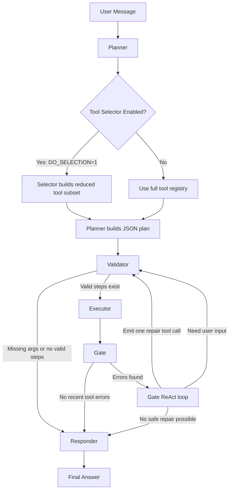

# Donor Agent Technical Documentation

Approaches Implemented & System Architecture

Version 2.0 | March 2026

# 1. Overview

> *This agent reads a donor’s request, chooses the right tools (that interacts with backend server), runs them, repairs some failures automatically, and then answers using real system data rather than guessing.*

The Donor Agent is a unified conversational AI system that brings together charity discovery, donor transactions, and auction workflows inside one shared LangGraph pipeline.

<html><body><table><tr><td>Domain</td><td>Primary Responsibility</td><td>Current Backend</td></tr><tr><td>Charity Layer</td><td>Discover charities, fetch charity details, inspect website content, support charity comparisons</td><td>Giverr production API + MCP fetch tool</td></tr><tr><td>Transaction Layer</td><td>Wallet, payment methods, campaigns, grants, product donations, transaction history</td><td>Giverr production API</td></tr><tr><td>Auction Layer</td><td>Browse auctions, inspect auction detail, review bid history, place bids</td><td>Giverr production API</td></tr></table></body></html>

All three domains share the same execution model:

- one graph
- one planner
- one validator
- one executor
- one repair gate
- one responder
- one message history system

This means the assistant behaves as one coordinated worker rather than three separate chatbots.

<br>

<br>

# 2. System Architecture

# 2.1 LangGraph Pipeline

Every user request moves through a directed graph defined in `main_agent.py` and `nodes.py`.

The graph contains five active nodes:

1. Planner
2. Validator
3. Executor
4. Gate
5. Responder

The graph starts at `planner` and ends at `responder`.

<br><br>

<br>

<br>

<br>

<br>



# 2.2 Node Responsibilities

# Planner

The planner receives:

- the latest user message
- a formatted view of previous conversation history
- a dynamically rendered catalog of the currently registered tools

It then uses the LLM to produce strict JSON with two keys:

<html><body><table><tr><td>Field</td><td>Meaning</td></tr><tr><td>steps</td><td>Ordered list of tool calls to execute</td></tr><tr><td>missing_args</td><td>Inputs that must be collected from the user before execution can continue</td></tr></table></body></html>

The planner is intentionally biased toward full coverage. If the required information is not already present in successful prior tool outputs, it is instructed to schedule the maximum relevant tool plan rather than under-plan.

# Planner Selector Function

The planner has an optional selector stage controlled by the `DO_SELECTION` environment flag.

When enabled, `build_tool_context()` first asks the LLM to choose a maximal plausible subset of tools before the actual planning prompt is built.

<html><body><table><tr><td>Mode</td><td>Behavior</td></tr><tr><td>`DO_SELECTION = false`</td><td>The planner sees the full registered tool catalog</td></tr><tr><td>`DO_SELECTION = true`</td><td>A selector prompt first reduces the tool list to a plausible subset, and the planner then plans only within that reduced catalog</td></tr></table></body></html>

Why this exists:

- it can reduce prompt size
- it can reduce planner confusion when many tools exist
- it is designed to remove only clearly implausible tools, not aggressively narrow the search space

# Validator

The validator checks the plan before any tool is executed.

It performs three core duties:

<html><body><table><tr><td>Check</td><td>Behavior</td></tr><tr><td>Tool existence</td><td>Removes plan steps whose tool names are not present in the live tool registry</td></tr><tr><td>Missing inputs</td><td>Stops execution and tells the responder to ask the user for the missing values</td></tr><tr><td>No-tool case</td><td>Routes directly to final response when the request can be answered from existing history</td></tr></table></body></html>

# Executor

The executor is a tool runner, not a reasoning agent.

It:

- executes the validated tools one by one
- supports async invocation when available
- records every call as an `AIMessage` with a generated tool call ID
- stores every result as a `ToolMessage`

Each result is normalized into a predictable envelope:

Success:

`{"ok": true, "result": {...}}`

Failure:

`{"ok": false, "error": "reason"}`

This makes downstream processing tool-agnostic.

# Gate (ReAct Repair Agent)

The gate runs after the executor.

Its purpose is to detect tool failures and attempt automatic repair cycles. The current implementation is not a generic replanner that returns a fresh full plan in one shot. It is a targeted ReAct-style repair agent that:

- looks only at the current round of execution
- inspects recent tool outputs for failures using explicit `ok: false` markers and semantic error detection
- assigns each error a unique identifier (`E1`, `E2`, etc.)
- chooses one unresolved error to work on next based on reactive context
- decides one repair action at a time
- executes that repair step immediately inside the gate via `_invoke_tool`
- updates fixed error tracking and tracks all attempt history
- repeats for up to `GATE_MAX_REACT_STEPS` iterations

It detects failures using `detect_recent_tool_errors()` which identifies:

- explicit `ok: false` failures in normalized tool payloads
- backend payloads that encode failure as `success: false`
- traceback-like strings (Traceback, IndentationError, SyntaxError, NameError, KeyError, TypeError, ValueError, etc.)
- common error markers such as `SyntaxError`, `TypeError`, `Invalid`, or `missing`
- semantic errors returned by `_detect_semantic_error()` (e.g., zero result sets when data is expected)

For each ReAct step, the gate prompt asks the LLM to return exactly one JSON decision:

<html><body><table><tr><td>Field</td><td>Meaning</td></tr><tr><td>`target_error_id`</td><td>Which unresolved error (E1, E2, etc.) to work on now, chosen reactively</td></tr><tr><td>`step`</td><td>At most one repair tool call to attempt next: `{"tool": "tool_name", "args": {...}}`</td></tr><tr><td>`mark_target_fixed_if_success`</td><td>Whether a successful step should resolve the selected error, or if it’s only prerequisite work</td></tr><tr><td>`done`</td><td>Stop repairing if no safe automatic step exists</td></tr><tr><td>`reason`</td><td>Evidence-based explanation of why this error is chosen and why this repair is appropriate</td></tr><tr><td>`missing_args`</td><td>User inputs the gate could not derive from tools, cache, or history</td></tr></table></body></html>

This is especially useful when a multi-step request depends on one tool’s output being transformed by another tool, such as Python-based numeric analysis, prerequisite discovery, ID recovery, or structured data assembly.

# Gate ReAct Behavior

The gate maintains internal state for the current repair pass across the `max_react_steps` loop:

- **original detected errors**: Each tagged with an `E1`, `E2`, ... identifier extracted by `detect_recent_tool_errors()`
- **fixed error tracking**: Set of error IDs already marked as fixed by prior repair steps
- **unresolved errors**: Currently unresolved errors (original minus fixed)
- **attempted repair steps**: Full log of each repair step, its arguments, success/failure, and output
- **seen step signatures**: Set of normalized step signatures to prevent duplicate attempts
- **successful tool outputs cache**: Built from base messages plus emitted messages via `build_cached_tool_outputs()`
- **missing user args**: Initially from planner, updated by gate decision `missing_args`
- **LLM visible history**: Original round messages, frozen to allow the LLM to see context consistently

The gate follows these operational rules:

**Safety & Grounding:**
- must not invent IDs, passwords, URLs, numeric values, or other arguments not grounded in history or cache
- filters repair arguments against the real tool schema before invoking the tool via `_filter_args_for_tool()`
- avoids duplicate or semantically equivalent repair steps in the same gate run using step signature tracking
- can choose a prerequisite repair step before retrying a downstream tool
- can stop with `step: null` when no safe repair exists

**Repair Strategy:**
- reactive error selection: chooses which error to work on based on current state, not a pre-determined order
- reactive step selection: chooses one repair step at a time, informed by cached outputs and prior attempts
- respects tool dependency rules from tool descriptions when prioritizing prerequisite repairs
- uses cached successful outputs to ground arguments for new repair steps

**State Management:**
- can return `missing_args` when repair requires new user input (routed back to validator → responder)
- marks errors fixed when the repair succeeds and `mark_target_fixed_if_success` is true, or when the tool that ran matches the tool from the target error
- continues to the next ReAct iteration if unresolved errors remain and `done` is false
- breaks the loop early if no safe repair is possible, if invalid JSON is returned, or if max iterations reached

**Output Tracking:**
- emits an `AIMessage` with tool call metadata and a matching `ToolMessage` for each repair attempt
- records each attempt in `attempt_log` with: react_step, target_error_id, tool, args, ok, output
- captures the final repair step as `last_agentic_step` to be persisted to conversation history

<html><body><table><tr><td>Behavior</td><td>Implementation Detail</td></tr><tr><td>Error discovery</td><td>`detect_recent_tool_errors()` runs once at gate entry, inspects current round only, ignores failures already resolved</td></tr><tr><td>Reactive loop state</td><td>Each iteration uses current `_current_unresolved_errors()` and `_current_fixed_errors()` views to decide what to work on</td></tr><tr><td>One-step execution</td><td>The gate emits an `AIMessage` tool call and a matching `ToolMessage` result for each repair attempt, then updates attempt_log</td></tr><tr><td>Semantic error detection</td><td>After tool returns, payload is checked by `_detect_semantic_error()` to flag e.g. empty result sets as failures even if `ok: true`</td></tr><tr><td>Direct fix</td><td>If repair succeeds and `mark_target_fixed_if_success` is true OR tool_name matches target error tool, error is added to fixed_error_ids</td></tr><tr><td>Prerequisite fix</td><td>If repair succeeds but is marked as prerequisite only, the target error remains unresolved for a later step</td></tr><tr><td>User input needed</td><td>The gate returns `missing_args` in the final decision, which are routed back through validator so responder can ask the user</td></tr><tr><td>No safe repair</td><td>The gate sets `done: true` and stops, emitting a system note with unresolved errors to the responder</td></tr><tr><td>Duplicate prevention</td><td>Step signatures are computed via `_step_signature()` and checked against `seen_step_signatures` to skip semantically identical attempts</td></tr><tr><td>Final step capture</td><td>`last_agentic_step` is sourced from attempt_log AFTER tool execution, capturing real success/failure and output</td></tr><tr><td>History serialization</td><td>Final `last_agentic_step` is formatted by `_format_last_agentic_step()` and added as an AIMessage for durable conversation context</td></tr></table></body></html>

The limit for internal ReAct iterations is loaded from the `GATE_MAX_REACT_STEPS` environment variable (default 1).

# Responder

The responder produces the final user-facing answer.

It receives a cleaned version of the conversation history and is instructed to:

- use only information explicitly present in tool outputs
- avoid inventing facts
- keep the answer donor-friendly
- ask for the minimum missing input when required

The responder also has special behavior for password failures and reuses prior successful tool outputs from conversation history where appropriate.

# 2.3 Routing Logic

Two routing functions in `routing.py` control the graph transitions after validation and repair.

<html><body><table><tr><td>Decision Point</td><td>Condition</td><td>Route</td></tr><tr><td>After Validator</td><td>At least one valid tool step exists</td><td>Executor</td></tr><tr><td>After Validator</td><td>No valid steps remain, either because tools are unnecessary or because user input is missing</td><td>Responder</td></tr><tr><td>After Gate</td><td>`missing_args` returned by gate</td><td>Validator</td></tr><tr><td>After Gate</td><td>No missing args returned by gate</td><td>Responder</td></tr></table></body></html>

# 2.4 State Schema

The graph carries a shared `AgentState` object.

<html><body><table><tr><td>Field</td><td>Type</td><td>Purpose</td></tr><tr><td>messages</td><td>Sequence of LangChain messages</td><td>Complete interaction history including user input, tool calls, tool outputs, and AI responses</td></tr><tr><td>plan</td><td>Dictionary</td><td>Current execution plan from planner or gate</td></tr><tr><td>repair_attempts</td><td>Integer</td><td>Prevents infinite repair loops</td></tr><tr><td>last_tool_error</td><td>Dictionary</td><td>Stores the latest detected tool failure for debugging and control flow</td></tr></table></body></html>

# 3. Tool Registry

# 3.1 Tool Loading Strategy

All tools are assembled in `tools/tool_setup.py`.

The registry combines four sources:

<html><body><table><tr><td>Source</td><td>What It Adds</td></tr><tr><td>`tools/analytics.py`</td><td>Charity discovery and charity detail tools</td></tr><tr><td>`tools/transactions.py`</td><td>Wallet, payment, campaign, grant, donation, and history tools</td></tr><tr><td>`tools/auctions.py`</td><td>Auction browsing, bid history, bidding, and category-based charity tools</td></tr><tr><td>MCP + Local Utility Tools</td><td>`fetch_url` from MCP and `PythonREPLTool` for calculations</td></tr></table></body></html>

At runtime the tool registry is dynamic, meaning the planner sees the tools that are actually loaded, not a fixed list hardcoded in the prompt.

The registry is also the input to the optional selector function. When selector mode is enabled, the system first asks the LLM which tools are plausibly relevant, then passes only that reduced set into the main planner prompt.

# 3.2 Charity Tools

The current charity layer differs from the older `Agent.md` file. The live code exposes these charity tools:

<html><body><table><tr><td>Tool</td><td>Type</td><td>Current Purpose</td></tr><tr><td>discover_charities</td><td>StructuredTool</td><td>Fetch a broad charity list for discovery, ranking, and obtaining charity IDs</td></tr><tr><td>charity_details</td><td>StructuredTool</td><td>Fetch detail for one charity, including donation metrics, products, blogs, address, and contact data</td></tr><tr><td>fetch_url</td><td>MCP Tool</td><td>Fetch website content from the charity website URL for richer answering</td></tr><tr><td>Python_REPL</td><td>Local Tool</td><td>Run Python code for calculations and transformations</td></tr></table></body></html>

Charity endpoints currently used:

<html><body><table><tr><td>Tool</td><td>Method</td><td>Endpoint / Mechanism</td></tr><tr><td>discover_charities</td><td>GET</td><td>/api/v3/agent/charities/discovery</td></tr><tr><td>charity_details</td><td>GET</td><td>/api/v3/agent/charities/{charityId}/detail</td></tr><tr><td>fetch_url</td><td>MCP</td><td>External fetcher process via `npx -y fetcher-mcp`</td></tr><tr><td>Python_REPL</td><td>Local</td><td>In-process Python execution</td></tr></table></body></html>

# 3.3 Transaction Tools

The transaction layer (`tools/transactions.py`) currently exposes these tools:

<html><body><table><tr><td>Tool</td><td>Method</td><td>Auth</td><td>Description</td></tr><tr><td>`check_wallet_balance`</td><td>GET</td><td>Bearer token</td><td>Fetch wallet balance, currency, and account status for the authenticated donor</td></tr><tr><td>`list_saved_payment_methods`</td><td>GET</td><td>Bearer token</td><td>List all saved payment methods on the donor account</td></tr><tr><td>`create_payment_method_url`</td><td>GET</td><td>Bearer token</td><td>Return a hosted payment method registration URL for adding a new card/bank account</td></tr><tr><td>`list_charities_in_country`</td><td>GET</td><td>API key</td><td>List charities available for a specified country code</td></tr><tr><td>`list_charity_products`</td><td>GET</td><td>API key</td><td>List donation products for a specific charity (requires charity ID)</td></tr><tr><td>`list_charity_active_campaigns`</td><td>GET</td><td>API key</td><td>List active fundraising campaigns for a charity</td></tr><tr><td>`list_charity_grants`</td><td>GET</td><td>API key</td><td>List available grants/matching donation programs for a charity</td></tr><tr><td>`get_transaction_history`</td><td>GET</td><td>Bearer token</td><td>Fetch the donor's transaction history with timestamps and statuses</td></tr><tr><td>`fund_wallet`</td><td>POST</td><td>Bearer token + password</td><td>Add funds to the donor wallet using a saved payment method</td></tr><tr><td>`product_donation`</td><td>POST</td><td>Bearer token + password</td><td>Make a product-based donation to a charity</td></tr><tr><td>`campaign_donation`</td><td>POST</td><td>Bearer token + password</td><td>Make a campaign donation contribution</td></tr><tr><td>`grant_donation`</td><td>POST</td><td>Bearer token + password</td><td>Make a grant/matching donation</td></tr></table></body></html>

**Key Implementation Details:**
- All transaction tools use hardcoded bearer tokens in source (demo-only, not production-ready)
- Password-gated write operations (`fund_wallet`, `*_donation` tools) require explicit password verification via `verify_user_password()` before API submission
- Read operations use API-key-only headers; write operations require Bearer token authentication
- Tool results are normalized into the standard `{"ok": true/false, "result": {...}}` envelope
- Error responses include HTTP status, endpoint path, and truncated response text for debugging

# 3.4 Auction Tools

The auction layer (`tools/auctions.py`) exposes these tools:

<html><body><table><tr><td>Tool</td><td>Method</td><td>Auth</td><td>Description</td></tr><tr><td>`get_active_auctions`</td><td>GET</td><td>API key</td><td>Fetch all currently active auctions with pagination; returns list of auction objects with title, minBidAmount, incrementType, incrementValue, and timestamps</td></tr><tr><td>`get_auction_details`</td><td>GET</td><td>API key</td><td>Fetch one auction by exact MongoDB `_id`; includes condition, reserve price, and increment rules</td></tr><tr><td>`get_my_bid_history`</td><td>GET</td><td>API key</td><td>Fetch the donor’s complete bid history across all auctions; returns list of bids with status (Pending, Won, Lost) and amounts</td></tr><tr><td>`place_bid`</td><td>POST</td><td>Bearer token + password</td><td>Place a bid on an active auction; requires exact auction `_id`, positive amount, and password verification</td></tr><tr><td>`get_donation_categories`</td><td>GET</td><td>API key</td><td>List all donation categories (chanda, fitra, hadya, saqdah, etc.); step 1 of category-based charity lookup</td></tr><tr><td>`get_charities_by_donation_type`</td><td>GET</td><td>API key</td><td>List charities accepting a specific donation category; requires `donation_type_id` from `get_donation_categories`</td></tr></table></body></html>

Auction endpoints and implementation details:

<html><body><table><tr><td>Tool</td><td>Method</td><td>Endpoint</td><td>Implementation Notes</td></tr><tr><td>`get_active_auctions`</td><td>GET</td><td>`/api/v3/agent/auctions/list`</td><td>Pagination support via `page` and `limit` query params; returns `data.auctions` and `data.pagination`</td></tr><tr><td>`get_auction_details`</td><td>GET</td><td>`/api/v3/agent/auctions/{auction_id}`</td><td>Requires exact ObjectId string; sanitizes input and returns error if _id is missing or malformed</td></tr><tr><td>`get_my_bid_history`</td><td>GET</td><td>`/api/v3/agent/user/{DONOR_PROFILE_ID}/bids`</td><td>Uses hardcoded `DONOR_PROFILE_ID` constant (currently a placeholder); returns list of bid records with auction references</td></tr><tr><td>`place_bid`</td><td>POST</td><td>`/api/v3/agent/auctions/{auction_id}/bid`</td><td>Requires password verification first via `verify_user_password()`; validates amount > 0; sends `{"bidAmount": amount}` in body</td></tr><tr><td>`get_donation_categories`</td><td>GET</td><td>`/api/v3/agent/donation-categories`</td><td>No args required; returns list of category objects with `_id` and `name`</td></tr><tr><td>`get_charities_by_donation_type`</td><td>GET</td><td>`/api/v3/agent/charities/by-donation-type`</td><td>Query params: `donationTypeId` (required), `countryCode` (defaults to "PK"); returns charities filtered by category and location</td></tr></table></body></html>

**Key Constraints & Behavioral Rules:**
- `get_active_auctions` must be called first before `get_auction_details` or `place_bid` to obtain valid auction `_id` values (NOT display numbers)
- `get_donation_categories` must be called before `get_charities_by_donation_type` to resolve the category `_id`
- `place_bid` requires THREE inputs: exact auction `_id`, explicit bid `amount`, AND password (explicitly provided by user, not invented)
- Bid failure cases include: invalid `_id`, zero/negative amount, missing password, or failed password verification
- `get_my_bid_history` is the ONLY correct tool for bid history requests; never substitute `check_wallet_balance`
- Tool descriptions embed detailed ordering constraints and dependency rules to guide planner and gate repair logic

# 3.5 Tool Guidance Embedded in Code

The tool descriptions are not just labels—they also contain operational instructions and behavioral constraints for the planner and gate repair agent. Every tool in `tools/transactions.py`, `tools/auctions.py`, and `tools/analytics.py` includes structured guidance.

**Examples of encoded tool guidance patterns:**

<html><body><table><tr><td>Guidance Pattern</td><td>Sections in Tool Description</td><td>Why It Matters</td></tr><tr><td>”Use exact `_id` only, never display numbers”</td><td>DO NOT USE WHEN section + REQUIRES section</td><td>Prevents the planner from sending human display numbers like 1 or 2 to backend endpoints; ensures data integrity and backend compatibility</td></tr><tr><td>”Call this FIRST before X”</td><td>MUST_CALL_FIRST + DEFAULT_CHAIN sections</td><td>Enforces multi-step flows such as `get_donation_categories` before `get_charities_by_donation_type`, or `get_active_auctions` before `get_auction_details`</td></tr><tr><td>”Password MUST be explicitly provided”</td><td>DO NOT USE WHEN + WHEN TO USE sections</td><td>Prevents sensitive actions such as `place_bid` from being executed without explicit user password input; gates transactional operations to prevent unauthorized actions</td></tr><tr><td>”Call this tool first to get required IDs”</td><td>CHAIN_OUTPUT_FOR_NEXT_TOOL section</td><td>Teaches the planner and gate that downstream tools depend on this tool's output, guiding prerequisite repair strategy</td></tr><tr><td>Dependency chains with placeholders</td><td>DEFAULT_CHAIN + CHAIN_OUTPUT_FOR_NEXT_TOOL</td><td>Allows planner to schedule the full chain at plan time using placeholders like `<AUCTION_ID_FROM_GET_ACTIVE_AUCTIONS>`, which gate can resolve at repair time</td></tr><tr><td>Empty data handling hints</td><td>WHEN TO USE + DO NOT STOP HERE sections</td><td>Guides planner behavior when a tool returns empty results (e.g., no auctions, no charities in that category)</td></tr></table></body></html>

**Tool Description Structure:**

Each tool's description follows a consistent pattern:

```
PURPOSE:
  [Core reason for the tool]

MUST_CALL_FIRST / DEPENDS_ON:
  [Prerequisites and entry conditions]

DEFAULT_CHAIN:
  [Typical multi-step orchestration pattern]

WHEN TO USE:
  [Trigger conditions and user phrases]

DO NOT USE WHEN:
  [Anti-patterns and when to avoid the tool]

REQUIRES (Intuitive Schema):
  [Simple argument summary]

REQUIRES (Detailed Schema):
  [Full schema with types and constraints]

RETURNS (Intuitive Schema):
  [User-friendly output summary]

RETURNS (Detailed Schema):
  [Complete output structure and nested fields]

CHAIN_OUTPUT_FOR_NEXT_TOOL:
  [How to pass this tool's output to downstream tools, including placeholder format]

DO NOT STOP HERE WHEN:
  [Hints for when to continue the chain]
```

**How Planner Uses Tool Guidance:**

1. **Dependency Ordering**: The planner reads `MUST_CALL_FIRST` and `DEFAULT_CHAIN` to sequence tools correctly
2. **Placeholder Arguments**: When a tool's output is needed but not yet available, the planner uses the placeholder format from `CHAIN_OUTPUT_FOR_NEXT_TOOL` (e.g., `<AUCTION_ID_FROM_GET_ACTIVE_AUCTIONS>`)
3. **Safety Constraints**: The planner respects `DO NOT USE WHEN` to avoid unsafe patterns (e.g., never pass invented `_id` values)
4. **Intent Preservation**: Descriptions guide the planner to choose the complete chain needed to answer the user, not a shortcut

**How Gate Uses Tool Guidance:**

1. **Repair Strategy**: When choosing a repair step, the gate reads `DEPENDS_ON` and `DEFAULT_CHAIN` to decide whether a prerequisite must be fixed first
2. **Argument Resolution**: The gate uses `CHAIN_OUTPUT_FOR_NEXT_TOOL` and cached tool outputs to assemble arguments for repair steps
3. **Semantic Consistency**: The gate enforces constraints like “password must be explicitly provided by user” before attempting transactional operations
4. **Error Prioritization**: The gate uses tool descriptions to understand which errors block which downstream operations, choosing repair order strategically

# 4. Charity Flow

# 4.1 Purpose

The charity flow helps the user:

- discover charities
- inspect one charity in depth
- compare charities using list data
- inspect a charity website when needed
- compute statistics using Python when a numeric transformation is required

# 4.2 Actual Current Flow

The current implementation is different from the old “single `get_charity_stats` tool” design.

The real code uses a two-level approach:

<html><body><table><tr><td>Step</td><td>Action</td></tr><tr><td>1</td><td>Use `discover_charities` to gather broad charity records and IDs</td></tr><tr><td>2</td><td>Use `charity_details` for one selected charity when deeper fields are needed</td></tr><tr><td>3</td><td>Use `fetch_url` to retrieve the charity website content when external context is useful</td></tr><tr><td>4</td><td>Use `Python_REPL` if the user asks for a calculation based on tool output</td></tr></table></body></html>

# 4.3 Example Charity Questions the System Can Handle

<html><body><table><tr><td>User Need</td><td>Likely Tool Pattern</td></tr><tr><td>“Show me charities”</td><td>`discover_charities`</td></tr><tr><td>“Tell me about this charity”</td><td>`charity_details`</td></tr><tr><td>“What does their website say?”</td><td>`charity_details` + `fetch_url`</td></tr><tr><td>“Which charity has the highest donor count?”</td><td>`discover_charities` and optional `Python_REPL` for sorting or aggregation</td></tr></table></body></html>

# 5. Transaction Flow

# 5.1 Purpose

The transaction flow supports donor financial actions and account visibility.

It can help the user:

- check wallet status
- review payment methods
- fund the wallet
- browse campaigns and grants
- donate to campaigns, grants, or products
- inspect transaction history

# 5.2 Authentication Model

Transaction tools currently use a hardcoded bearer token in `tools/transactions.py`.

This means:

- the assistant is currently tied to a demo donor context
- it is not yet using a real logged-in session
- the behavior is suitable for controlled testing, not production-grade identity isolation

# 5.3 Password Verification

Sensitive actions in the current implementation can require password verification.

For example, `place_bid` in the auction layer imports `verify_user_password` from the transaction layer before submitting the actual API call.

The current password flow is local and demo-oriented:

<html><body><table><tr><td>Current Behavior</td><td>Meaning</td></tr><tr><td>Bcrypt hash stored in code</td><td>Password verification is mocked locally instead of delegated to a production identity system</td></tr><tr><td>Responder special-case</td><td>If password validation fails, the conversation can prompt the user to enter the password again</td></tr></table></body></html>

# 6. Auction Flow

# 6.1 Purpose

The auction flow lets the user:

- browse available auctions
- inspect a specific auction
- review personal bid history
- place bids with password confirmation

# 6.2 Bid Execution Rules in Current Code

The current code enforces several important rules before placing a bid:

<html><body><table><tr><td>Rule</td><td>Implementation Intent</td></tr><tr><td>Exact auction ID required</td><td>`place_bid` expects the real backend `_id`, not a display number</td></tr><tr><td>Positive amount required</td><td>The tool rejects zero or negative bids</td></tr><tr><td>Password required</td><td>The tool fails fast if password is missing</td></tr><tr><td>Password verified before request</td><td>The tool checks the password locally before sending the API bid request</td></tr></table></body></html>

# 6.3 Auction Identity Headers

Auction tools currently use:

- `X-API-KEY`
- encrypted `X-USER-ID` for user-scoped actions

The user ID is encrypted with AES-256-CBC inside `tools/auctions.py` before being sent in headers.

This is an implementation detail intended to match the expected backend contract.

# 6.4 Current Auction Limitation

`get_my_bid_history` uses a placeholder value:

`DONOR_PROFILE_ID = "PENDING"`

This means that bid-history behavior is not yet fully production-ready unless that value is replaced with the correct donor profile ID at runtime.

# 7. Shared Infrastructure

# 7.1 LLM Configuration

The planner, gate, and responder all call `make_model()` from `llm.py`.

<html><body><table><tr><td>Setting</td><td>Current Behavior</td></tr><tr><td>Client Library</td><td>`langchain_openai.ChatOpenAI`</td></tr><tr><td>Serving Pattern</td><td>OpenAI-compatible API usage, which can target NVIDIA NIM model endpoints</td></tr><tr><td>Authentication</td><td>API key is passed through the OpenAI-compatible client configuration</td></tr><tr><td>Model</td><td>The model name is configured in `llm.py` and can represent an NVIDIA NIM-served model when the client is pointed to that endpoint</td></tr><tr><td>Temperature</td><td>0.0 for deterministic responses</td></tr></table></body></html>

The selector function, when enabled, uses the same model instance pattern as the planner.

# 7.2 History Formatting

History formatting is one of the core engineering choices in this project.

Different nodes receive different views of the same conversation:

<html><body><table><tr><td>Formatter</td><td>Used By</td><td>Purpose</td></tr><tr><td>`format_history_for_planner`</td><td>Planner</td><td>Shows reusable successful past outputs without clutter from the current user turn</td></tr><tr><td>`format_history_for_gate`</td><td>Gate</td><td>Shows only the current round so repair logic can focus on recent failures</td></tr><tr><td>`format_history_for_responder`</td><td>Responder</td><td>Builds a clean transcript for final answer generation</td></tr><tr><td>`build_cached_tool_outputs`</td><td>Gate</td><td>Provides latest tool outputs to help the repair prompt build corrected tool steps</td></tr></table></body></html>

# 7.3 Sensitive Data Handling

Sensitive values are sanitized before they are placed back into LLM-visible history.

The current sanitization logic removes fields such as:

- authorization
- token
- api_key
- password
- secret
- private_key

This behavior is implemented in `tools/json_utils.py` and `history_formatters.py`.

# 7.4 JSON Utilities

The project uses defensive JSON helpers so malformed LLM output does not crash the pipeline.

<html><body><table><tr><td>Function</td><td>Purpose</td></tr><tr><td>`_extract_first_json_object`</td><td>Recovers the first valid JSON object from noisy LLM output</td></tr><tr><td>`_parse_plan`</td><td>Parses planner and gate output into a safe default structure</td></tr><tr><td>`_safe_json_loads`</td><td>Loads JSON without throwing hard errors</td></tr><tr><td>`_compact_json`</td><td>Truncates long payloads for prompt efficiency</td></tr><tr><td>`_summarize_tool_output`</td><td>Compresses tool results into a prompt-friendly summary</td></tr></table></body></html>

# 7.5 Response Normalization

Although not every tool returns data in exactly the same raw format, the executor attempts to normalize results before storing them in the graph history.

This is a major reason the agent can combine tools from different code styles in one pipeline.

# 8. Environment & Running the Agent

# 8.1 Main Runtime Requirements

Based on the current codebase and README, the system depends on:

<html><body><table><tr><td>Requirement</td><td>Purpose</td></tr><tr><td>Python environment</td><td>Runs the LangGraph agent and local tools</td></tr><tr><td>OpenAI-compatible model access</td><td>Enables planner, selector, gate, and responder LLM calls, including NVIDIA NIM deployments exposed through an OpenAI-compatible interface</td></tr><tr><td>Node / npm</td><td>Runs MCP fetch tooling and optional local servers</td></tr><tr><td>External API availability</td><td>Required for charity, transaction, and auction data calls</td></tr></table></body></html>

# 8.2 Important Environment Variables

<html><body><table><tr><td>Variable</td><td>Required</td><td>Description</td></tr><tr><td>OPENAI_API_KEY or equivalent configured key</td><td>Yes</td><td>Credential used by the OpenAI-compatible client, including NVIDIA NIM when exposed through that interface</td></tr><tr><td>OPENAI_BASE_URL or equivalent endpoint setting</td><td>Required for custom NIM deployments</td><td>Points the OpenAI-compatible client to the NVIDIA NIM server instead of a default hosted endpoint</td></tr><tr><td>Model name</td><td>Yes in practice</td><td>Name of the model exposed by the OpenAI-compatible endpoint and selected in `llm.py`</td></tr><tr><td>GATE_MAX_REACT_STEPS</td><td>No</td><td>Maximum number of one-step ReAct repair attempts inside a single gate pass</td></tr><tr><td>DEBUG_MESSAGES</td><td>No</td><td>Prints detailed prompts and responses for debugging</td></tr><tr><td>DO_SELECTION</td><td>No</td><td>Enables LLM-based selector mode to reduce the visible tool catalog before planning</td></tr><tr><td>TRUNCATION_TOOL_LIMIT</td><td>Yes in practice</td><td>Controls tool output summarization length</td></tr></table></body></html>

# 8.3 Starting the Agent

The current repository is started from the terminal.

Typical flow:

1. Install Python and Node dependencies
2. Ensure `.env` contains the required values
3. Start any required local support services if the environment expects them
4. Run `python main_agent.py`

# 8.4 Dependencies

<html><body><table><tr><td>Package</td><td>Purpose</td></tr><tr><td>langchain-core</td><td>Base message types and tool abstractions</td></tr><tr><td>langchain-groq</td><td>Groq model integration</td></tr><tr><td>langchain-experimental</td><td>Provides `PythonREPLTool`</td></tr><tr><td>langgraph</td><td>Graph execution and state routing</td></tr><tr><td>langchain-mcp-adapters</td><td>MCP client integration</td></tr><tr><td>requests</td><td>HTTP calls to backend services</td></tr><tr><td>pydantic</td><td>Structured tool schemas</td></tr><tr><td>rich</td><td>Terminal rendering and debug output</td></tr><tr><td>python-dotenv</td><td>Environment variable loading</td></tr><tr><td>pycryptodome</td><td>AES encryption used for auction user header generation</td></tr><tr><td>bcrypt</td><td>Password verification in the demo flow</td></tr></table></body></html>

# 9. Key Design Decisions

# LLM-Free Execution Layer

The executor does not reason about what to do next. It only runs the tools chosen by the planner.

This separation improves speed and reduces cost because tool execution itself does not require another LLM reasoning cycle.

# Gate Uses Targeted ReAct

Instead of using a fully iterative ReAct-style agent for every turn, this project uses a targeted ReAct repair agent only when recent tool execution fails.

This keeps most successful flows lightweight, while still allowing automatic correction when a tool plan partially breaks. The ReAct loop is scoped to repair, not to the full end-to-end conversation.

# Structured History Reuse

The planner and responder can reuse prior successful tool outputs from conversation history. This reduces duplicate API calls and helps the system answer follow-up questions more efficiently.

# Tool Descriptions as Behavioral Controls

Tool descriptions act as soft operational policy. They do not merely describe tools; they teach the planner when and how to use them safely.

# 10. Known Gaps and Production Risks

The current implementation is effective for prototyping and internal demos, but several gaps remain:

<html><body><table><tr><td>Risk Area</td><td>Current Reality</td></tr><tr><td>Secrets management</td><td>Several credentials and tokens are hardcoded in source files</td></tr><tr><td>Identity</td><td>The agent acts as a pre-authenticated demo user instead of using a live user session</td></tr><tr><td>Tool consistency</td><td>Some tools use the shared `_ok/_fail` envelope while others return custom dicts</td></tr><tr><td>Documentation drift</td><td>The older `Agent.md` no longer exactly matches the live codebase</td></tr><tr><td>Auction history setup</td><td>`DONOR_PROFILE_ID` is still a placeholder in the auction module</td></tr><tr><td>Deployment model</td><td>The current entry point is a terminal application, not a hardened service API</td></tr></table></body></html>
